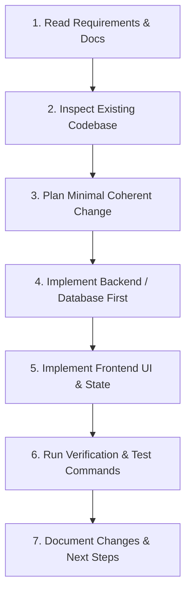

# AGENTS.md — Persistent Instructions for AI Coding Agents

> **Project:** SehatSetu — Smart Patient Queue & Emergency Triage  
> **Repository:** `https://github.com/Syed-Sameer13/SehatSetu.git`  
> **Role:** Hospital patient registration, deterministic triage rules, dynamic queue management, and clinical decision support.

This document establishes the mandatory operational rules, architectural boundaries, coding standards, and verification procedures for any AI coding agent (including Google Antigravity) working on this codebase.

---

## 1. Prime Directives & System Boundaries

1. **Safety & Clinical Boundaries:**
   - **Never** present the application or AI as an autonomous diagnostic tool or clinical decision maker.
   - All preliminary triage calculations are **decision-support indicators** generated by deterministic, transparent, and clinician-auditable rule sets.
   - Urgency categories (`CRITICAL`, `HIGH`, `MODERATE`, `LOW`, `NEEDS_REVIEW`) and visit statuses (`WAITING`, `CALLED`, `IN_CONSULTATION`, `COMPLETED`, `CANCELLED`) must strictly match the agreed definitions.
   - AI-assisted symptom summaries must be strictly extractive/summarizing; they must **never** invent medical facts, prescribe medication, or alter triage urgency levels.

2. **Data & Privacy Integrity:**
   - Always use **synthetic, de-identified patient data** in tests, seed files, and UI mocks. Never insert real Personally Identifiable Information (PII) or Protected Health Information (PHI).
   - Never commit API keys, service role keys, database passwords, or JWT secrets to source code or version control.
   - Never expose `SUPABASE_SERVICE_ROLE_KEY` or direct privileged PostgreSQL connections to the browser/frontend.

3. **Engineering Integrity & Non-Destructive Progress:**
   - **Inspect before modifying:** Always examine existing files, types, and database migrations before altering code.
   - **Do not rewrite functioning code:** Refactor incrementally without wiping out working vertical slices.
   - **No fake operations:** Never mock successful database writes or hardcode fake metrics in production code paths to simulate functionality.
   - **No dead UI elements:** Avoid inserting non-functional buttons, dummy links, or placeholder menus that do not connect to a working backend or client action.

---

## 2. Technology Stack & Architectural Roles

| Tier | Technology | Agent Responsibilities & Rules |
| :--- | :--- | :--- |
| **Frontend** | React 18+, Vite, TypeScript, Tailwind CSS, shadcn/ui, TanStack Query | Maintain modular component structure under `frontend/src/`. Use strict TypeScript types. Handle loading, empty, and error states explicitly. |
| **Backend** | Python 3.11+, FastAPI, Pydantic v2, SQLAlchemy | Implement RESTful endpoints under `/api/v1`. Enforce request validation via Pydantic schemas. Keep business logic and triage rules inside `app/services/`. |
| **Database** | Supabase PostgreSQL, RLS, Realtime | Maintain SQL migrations under `supabase/migrations/`. Enforce Row Level Security policies. Use indexed foreign keys and strict constraints. |
| **AI / NLP** | Deterministic Rules Engine + Gemini API (Optional Summary) | Implement rule logic in deterministic Python modules with explainable score breakdowns. Fallback gracefully if AI endpoints are unreachable. |

---

## 3. Strict Coding Conventions

### Backend (Python / FastAPI)
- **Code Style:** PEP 8, formatted with `ruff` or `black`, typed strictly with `mypy`.
- **Directory Layout:**
  ```text
  backend/
  ├── app/
  │   ├── api/          # Route handlers (/api/v1)
  │   ├── core/         # Config, security, database session
  │   ├── models/       # SQLAlchemy models
  │   ├── schemas/      # Pydantic schemas (request/response)
  │   ├── services/     # Triage rules engine, queue logic, AI service
  │   └── main.py       # FastAPI application entrypoint
  └── tests/            # pytest suite (unit and integration)
  ```
- **Error Handling:** Return structured RFC 7807 problem details or standardized JSON error schemas (`{"detail": "...", "code": "..."}`) with appropriate HTTP status codes (400, 401, 403, 404, 409, 422, 500).
- **Concurrency & State:** Dynamic queue ordering (`urgency_score DESC, arrival_time ASC`) must be calculated server-side. Prevent race conditions on `call-next` operations using database transactions or conditional updates.

### Frontend (React / TypeScript / Vite)
- **Code Style:** Functional components with React hooks, typed strictly (no `any` types).
- **Directory Layout:**
  ```text
  frontend/
  ├── src/
  │   ├── components/   # UI primitives (shadcn) and domain widgets
  │   ├── pages/        # Route views (Dashboard, Queue, Registration, etc.)
  │   ├── hooks/        # Custom hooks & TanStack Query hooks
  │   ├── services/     # Typed API client functions
  │   ├── types/        # TypeScript interfaces matching backend schemas
  │   └── lib/          # Utilities, formatters, and Supabase client
  ```
- **State Management:** Use TanStack Query (React Query) for server state caching and optimistic updates; use React Hook Form + Zod for form validation.
- **Accessibility:** Semantic HTML, ARIA attributes where appropriate, keyboard navigation support for triage queues and modal dialogues.

---

## 4. Required Agent Workflow for Every Task

When assigned a feature, bug fix, or refactor, you must follow this exact progression:



1. **Phase 1: Research & Inspection**
   - Check `README.md`, `docs/ARCHITECTURE.md`, `docs/API_CONTRACT.md`, and `docs/DATABASE_SCHEMA.md`.
   - Inspect files in the current workspace using available read/view tools before creating or editing files.

2. **Phase 2: Execution**
   - Execute one atomic milestone at a time.
   - Preserve existing working code; do not overwrite files without verifying what is inside.
   - If an external dependency or service (e.g. Gemini API key or Supabase Realtime) is missing or unconfigured, implement an explicit, graceful fallback and log a warning rather than failing silently or crashing.

3. **Phase 3: Verification & Quality Checks**
   - Test backend endpoints with `pytest` or targeted curl/python scripts.
   - Test frontend compilation with `npm run build` or `npm run lint`.
   - Check for runtime errors, hydration mismatches, and broken API contracts.

4. **Phase 4: Agent Reporting**
   - Provide a concise summary of:
     - Exact files created or modified.
     - Commands executed and their status.
     - Verification test results.
     - Known limitations or remaining steps.

---

## 5. Standard Verification Commands

Agents should use the following commands to verify their changes:

### Backend Verification
```powershell
# Run backend tests
cd backend; pytest -v

# Check type hints
cd backend; mypy app/

# Format and lint check
cd backend; ruff check app/
```

### Frontend Verification
```powershell
# Type check TypeScript
cd frontend; npm run typecheck

# Lint check
cd frontend; npm run lint

# Production build check
cd frontend; npm run build
```

---

## 6. Prohibited Anti-Patterns

❌ **DO NOT:**
- Create mock databases in memory that discard patient registrations on server restart without documenting them as purely transient test doubles.
- Fabricate clinical claims (e.g., claiming 99.8% triage accuracy without clinical validation).
- Alter table or column names without updating `docs/DATABASE_SCHEMA.md`, backend models, and frontend types simultaneously.
- Hardcode simulated queue counts or arbitrary latency delays to mimic real-time updates.
- Leave orphaned `.env` files or hardcoded URLs pointing to localhost in production build configurations.
