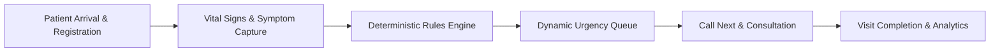

# SehatSetu (सेहत सेतु) — Smart Patient Queue & Emergency Triage

[](https://fastapi.tiangolo.com)
[](https://reactjs.org/)
[](https://tailwindcss.com/)
[](https://supabase.com)
[](LICENSE)

> **Healthcare Hackathon Project**  
> GitHub Repository: [`https://github.com/Syed-Sameer13/SehatSetu.git`](https://github.com/Syed-Sameer13/SehatSetu.git)

---

## 1. Executive Summary & Problem Statement

In resource-constrained and high-volume healthcare settings (such as public hospital OPDs and emergency rooms), patient queues are frequently managed on a strictly first-come, first-served (FCFS) basis or through fragmented paper records. This approach creates critical clinical risks:
- Deteriorating patients with subtle but severe symptoms wait behind non-urgent cases.
- Triage assessments are unstandardized and prone to cognitive overload during peak hours.
- Overcrowded waiting halls cause anxiety and staff burnout due to a lack of queue visibility.
- Hospital administrators lack real-time data on bottlenecks, department load, and patient turnaround times.

### The Solution: SehatSetu

**SehatSetu** ("Bridge to Health") is an open, web-based clinical workflow platform providing **rapid patient registration**, **transparent, deterministic preliminary triage scoring**, **real-time dynamic queue prioritization**, and **departmental patient flow analytics**. 

> **Important Clinical Safety Notice:**  
> SehatSetu provides **decision support** to assist healthcare workers in prioritizing queues. It **does not** replace professional medical judgment, provide diagnostic conclusions, or prescribe treatment. All automated suggestions are transparent, evidence-backed, and overridable by authorized staff.

---

## 2. Core Features



- **Rapid Patient Intake:** Streamlined single-page intake capturing patient demographic details, chief complaints, and objective vital observations (BP, SpO2, Heart Rate, Respiratory Rate, Temperature, Blood Glucose, GCS).
- **Deterministic, Explainable Triage Rules:** Preliminary urgency scoring (`CRITICAL`, `HIGH`, `MODERATE`, `LOW`, `NEEDS_REVIEW`) computed using transparent clinical rules with clear warning flags and missing-data notifications.
- **Dynamic Prioritization Engine:** Server-side queue ordering prioritizing patients by urgency level and arrival timestamp, preventing queue starvation.
- **Clinical Action Flow:** Dedicated staff controls for `Call Next`, `In Consultation`, `Transfer Department`, `Mark Completed`, or `Cancel Visit`.
- **Audited Priority Overrides:** Authorized clinicians can elevate or de-escalate patient priority with mandatory recorded rationale.
- **Real-Time Staff Dashboard:** Live updates on active queues, bed/consultation room availability, and waiting room metrics via Supabase Realtime.
- **Optional AI Symptom Summarization:** Secure, strictly extractive synthesis of lengthy patient descriptions into structured, clinical bullet points without hallucinations or autonomous diagnosing.
- **Departmental Analytics:** Live metrics on average wait times, active case distributions, triage urgency breakdowns, and bottleneck indicators.

---

## 3. Technology Stack

| Layer | Technologies | Key Responsibilities |
| :--- | :--- | :--- |
| **Frontend** | React 18, Vite, TypeScript, Tailwind CSS, shadcn/ui, TanStack Query, React Hook Form, Zod, Recharts, Lucide React | User interface, responsive queue views, client-side validation, live subscriptions, interactive analytics charts. |
| **Backend** | Python 3.11+, FastAPI, Pydantic v2, SQLAlchemy | REST API endpoints (`/api/v1`), deterministic triage scoring engine, queue sort algorithms, auth validation. |
| **Database & Auth** | Supabase PostgreSQL, Supabase Auth, Row Level Security (RLS), Supabase Realtime | Relational data persistence, secure role-based access control, WebSocket change notifications, migration management. |
| **AI / NLP** | Rule Engine + Google Gemini API (Optional) | Algorithmic scoring with score breakdown; optional extractive clinical symptom summarizer. |
| **Hosting & CI** | Vercel (Frontend), Render (Backend), Supabase Cloud (Data) | Production deployment, automated preview builds, and scalable managed database infrastructure. |

---

## 4. Repository Structure

```text
SehatSetu/
├── .env.example                  # Environment variable template
├── .gitignore                    # Version control ignore definitions
├── AGENTS.md                     # Persistent instructions for AI coding agents
├── CONTRIBUTING.md               # Contribution workflow and guidelines
├── README.md                     # Project documentation index and overview
├── docs/                         # Comprehensive project documentation
│   ├── PRODUCT_REQUIREMENTS.md   # Functional & non-functional requirements
│   ├── ARCHITECTURE.md           # Architecture, data flows & sequence diagrams
│   ├── DATABASE_SCHEMA.md        # PostgreSQL schema, tables, RLS & migrations
│   ├── API_CONTRACT.md           # REST API specification & schemas
│   ├── UI_UX.md                  # Design system, screen wireframes & states
│   ├── AI_AND_CLINICAL_SAFETY.md # Triage rules engine & AI safety boundaries
│   ├── SECURITY_PRIVACY.md       # RBAC, data protection & security controls
│   ├── ENVIRONMENT.md            # Environment variable specifications
│   ├── IMPLEMENTATION_ROADMAP.md # Phased implementation plan & 2-hr sprint
│   ├── TESTING.md                # Test strategy, unit/integration test suites
│   ├── DEPLOYMENT.md             # Render, Vercel & Supabase deployment guides
│   ├── DEMO_SCRIPT.md            # Hackathon presentation and demo walkthrough
│   ├── FEATURE_BACKLOG.md        # Prioritized feature list & stretch goals
│   └── ANTIGRAVITY_BUILD_GUIDE.md# Step-by-step instructions for AI agents
├── backend/                      # FastAPI Python Application
│   ├── app/
│   │   ├── api/                  # API routers (v1 endpoints)
│   │   ├── core/                 # Config, security, database session
│   │   ├── models/               # SQLAlchemy ORM models
│   │   ├── schemas/              # Pydantic validation schemas
│   │   ├── services/             # Triage engine, queue manager, AI client
│   │   └── main.py               # FastAPI entry point
│   ├── requirements.txt          # Python dependencies
│   └── tests/                    # Unit and integration test suite
├── frontend/                     # React / Vite / TypeScript Application
│   ├── src/
│   │   ├── components/           # UI components & widgets
│   │   ├── pages/                # Screen views (Dashboard, Queue, Intake)
│   │   ├── hooks/                # Custom React & TanStack Query hooks
│   │   ├── services/             # API client functions
│   │   ├── types/                # TypeScript interface definitions
│   │   └── App.tsx               # Main application router
│   ├── package.json              # Node dependencies
│   └── vite.config.ts            # Vite build configuration
└── supabase/                     # Supabase database configuration
    ├── migrations/               # SQL schema migrations
    └── seed.sql                  # Synthetic seed records for testing
```

---

## 5. Prerequisites & Local Setup

### Prerequisites
- **Node.js**: v18.x or v20.x LTS
- **Python**: v3.11+
- **Supabase Account / CLI**: Free tier Supabase project or local Docker Supabase
- **Git**: v2.30+

### Step-by-Step Installation

#### 1. Clone the repository
```bash
git clone https://github.com/Syed-Sameer13/SehatSetu.git
cd SehatSetu
```

#### 2. Configure Environment Variables
Copy `.env.example` to local environment files:
```bash
# In repository root or subfolders
cp .env.example backend/.env
cp .env.example frontend/.env.local
```
Update the placeholder values with your Supabase project credentials.

#### 3. Setup and Run Backend (FastAPI)
```bash
cd backend
python -m venv venv

# Windows (PowerShell)
.\venv\Scripts\Activate.ps1
# Linux / macOS
source venv/bin/activate

pip install -r requirements.txt
uvicorn app.main:app --reload --port 8000
```
Backend Swagger API documentation will be available at: `http://localhost:8000/docs`

#### 4. Setup and Run Frontend (React + Vite)
```bash
cd ../frontend
npm install
npm run dev
```
Frontend application will be accessible at: `http://localhost:5173`

---

## 6. Complete Documentation Index

For in-depth technical details, refer to the documentation in [`docs/`](./docs):

| Document | Description |
| :--- | :--- |
| 📋 [Product Requirements](./docs/PRODUCT_REQUIREMENTS.md) | User personas, functional requirements, MVP criteria, and workflows. |
| 🏗️ [Architecture](./docs/ARCHITECTURE.md) | System components, request lifecycles, realtime sync, and Mermaid diagrams. |
| 🗄️ [Database Schema](./docs/DATABASE_SCHEMA.md) | PostgreSQL tables, foreign keys, indexes, RLS policies, and migrations. |
| 🔌 [API Contract](./docs/API_CONTRACT.md) | Detailed REST endpoints, request/response JSON schemas, and error codes. |
| 🎨 [UI / UX Specification](./docs/UI_UX.md) | Design tokens, component hierarchy, screen mockups, and interaction states. |
| 🩺 [AI & Clinical Safety](./docs/AI_AND_CLINICAL_SAFETY.md) | Rules engine logic, explainable scoring, AI boundaries, and safety guardrails. |
| 🔒 [Security & Privacy](./docs/SECURITY_PRIVACY.md) | RBAC, RLS policies, token handling, synthetic data rules, and audit trails. |
| ⚙️ [Environment Variables](./docs/ENVIRONMENT.md) | Complete dictionary of configuration variables, scopes, and setup steps. |
| 🗺️ [Implementation Roadmap](./docs/IMPLEMENTATION_ROADMAP.md) | Phased development plan and rapid 2-hour hackathon execution timeline. |
| 🧪 [Testing Strategy](./docs/TESTING.md) | Unit, integration, queue concurrency, and clinical safety test cases. |
| 🚀 [Deployment Guide](./docs/DEPLOYMENT.md) | Production setup on Vercel (Frontend), Render (Backend), and Supabase. |
| 🎬 [Hackathon Demo Script](./docs/DEMO_SCRIPT.md) | 2-minute pitch walkthrough, synthetic demo scenarios, and key talking points. |
| 📌 [Feature Backlog](./docs/FEATURE_BACKLOG.md) | Prioritized backlog of core features, stretch goals, and future extensions. |
| 🤖 [Antigravity Build Guide](./docs/ANTIGRAVITY_BUILD_GUIDE.md) | Step-by-step instructions for AI coding assistants working in Antigravity. |

---

## 7. Known Limitations & Non-Goals

- **Non-Diagnostic:** SehatSetu does not provide definitive medical diagnoses, differential diagnoses, or drug prescriptions.
- **Decision Support:** Automated urgency assessments are preliminary recommendations intended to assist clinical triage staff.
- **Hackathon Scope:** Real-time bi-directional EHR integration (FHIR/HL7) and hardware vital monitor integration are planned future milestones not included in the initial prototype.

---

## 8. License

This project is open-source and licensed under the [MIT License](LICENSE).
