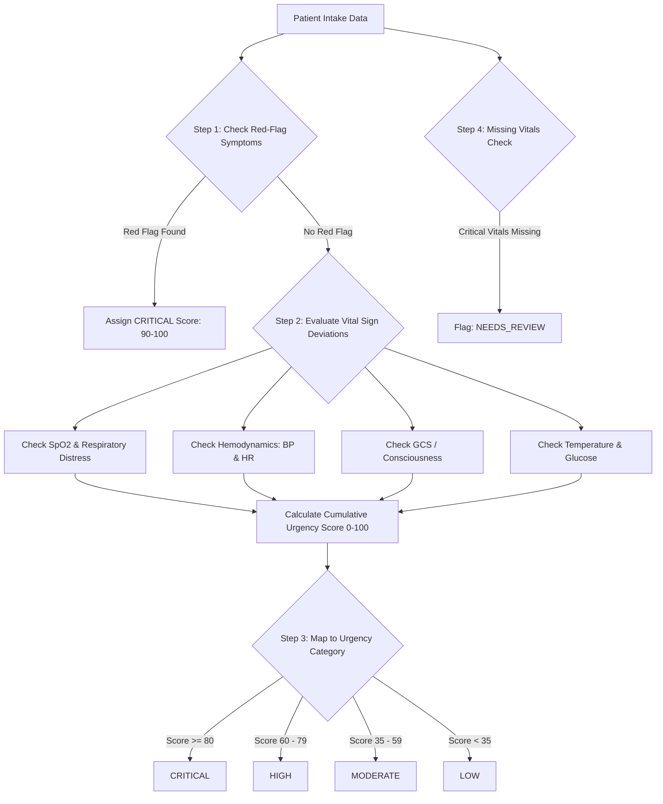

# AI Architecture & Clinical Safety Guardrails — SehatSetu

> **Document Version:** 1.0.0  
> **Classification:** Clinical Decision Support (CDS) Architecture & Safety Boundaries

---

## 1. Core Clinical Safety Principles & Disclaimers

> [!CAUTION]
> **MANDATORY CLINICAL SAFETY NOTICE:**  
> **SehatSetu is an administrative workflow and preliminary triage prioritization support tool.**  
> It does **NOT** provide medical diagnoses, formulate treatment plans, prescribe medications, or replace the qualified clinical judgment of certified physicians and nurses.  
> 
> All automated classifications are **preliminary suggestions** based on deterministic rule thresholds and must be verified by clinical staff upon physical inspection of the patient.

---

## 2. Deterministic Triage Rules Engine Architecture

Unlike non-deterministic, black-box machine learning models that can hallucinate or produce unpredictable outputs, SehatSetu uses a **transparent, rule-based clinical scoring engine** based on established physiological triage principles (such as the Emergency Severity Index and MEWS - Modified Early Warning Score concepts adapted for emergency queue triage).



---

## 3. Detailed Rule Matrix & Thresholds

### 3.1 Vital Sign Scoring Matrix

| Parameter | Normal Range | Moderate Risk (+15 pts) | High Risk (+30 pts) | Critical Risk (+50 pts / Flag) |
| :--- | :--- | :--- | :--- | :--- |
| **SpO2 (%)** | $\ge 95\%$ | $92\% - 94\%$ | $88\% - 91\%$ | $< 88\%$ |
| **Heart Rate (bpm)** | $60 - 100$ | $101 - 115$ or $50 - 59$ | $116 - 135$ or $40 - 49$ | $> 135$ or $< 40$ |
| **Systolic BP (mmHg)** | $100 - 130$ | $131 - 149$ or $90 - 99$ | $150 - 179$ or $80 - 89$ | $\ge 180$ or $< 80$ |
| **Respiratory Rate (bpm)**| $12 - 20$ | $21 - 25$ | $26 - 32$ or $< 10$ | $> 32$ or $< 8$ |
| **Temperature ($^\circ\text{F}$)** | $97.5 - 99.5$ | $99.6 - 101.5$ | $101.6 - 103.5$ or $< 95.0$ | $> 103.5^\circ\text{F}$ |
| **GCS Scale** | $15$ | $14$ | $12 - 13$ | $\le 11$ (Altered Mental State) |
| **Blood Glucose (mg/dL)** | $70 - 140$ | $141 - 200$ or $60 - 69$ | $201 - 350$ or $45 - 59$ | $> 350$ or $< 45$ |

### 3.2 Red-Flag Symptom Keyword Trigger Matrix
If the chief complaint contains any of the following clinician-defined high-risk clinical patterns, the engine elevates the score immediately:
- **Cardiovascular:** `chest pain radiating to arm`, `crushing chest pressure`, `sudden syncope`, `cardiac arrest`.
- **Neurological:** `sudden onset facial droop`, `unilateral weakness`, `acute slurred speech`, `active seizure`, `unresponsive`.
- **Respiratory:** `severe stridor`, `gasping for air`, `cyanosis / blue lips`, `inability to speak full sentences`.
- **Trauma / Hemorrhage:** `uncontrolled arterial bleeding`, `penetrating chest trauma`, `severe head injury with vomiting`.

---

## 4. Missing Data Handling & Detection

When intake occurs rapidly in high-stress situations, some vital signs may not be immediately measurable:
- **Missing Non-Critical Vitals:** (e.g. Temperature omitted) $\rightarrow$ Engine computes score on available parameters and attaches a flag: `missing_vital_flags: ["temperature_f"]`.
- **Missing Critical Vitals with Severe Symptoms:** If a patient presents with "chest pain" or "shortness of breath" but $\text{SpO}_2$ and Blood Pressure are omitted $\rightarrow$ Engine assigns category `NEEDS_REVIEW` and prompts the triage nurse with an alert: *"Critical vitals missing for high-risk symptom profile. Urgent nurse evaluation required."*

---

## 5. Optional AI Symptom Summarization Module

### 5.1 Architecture & Boundaries
To help physicians review verbose patient narratives quickly, an optional Large Language Model (e.g., Google Gemini 1.5 Flash) can be used.

**Strict Architectural Guardrails:**
1. **Extractive Only:** The model is strictly instructed to extract and bulletize stated symptoms, onset, and severity.
2. **Zero Diagnostic Generation:** The prompt explicitly forbids suggesting diagnoses, drug names, or recommending treatments.
3. **No Urgency Override:** The AI module's output is purely text for the doctor's screen; it has **no programmatic authority** to modify `urgency_category` or `priority_rank`.
4. **Deterministic Settings:** Temperature is set to `0.0` with strict output formatting.

### 5.2 System Prompt Template for LLM Summarization

```text
You are an extractive clinical text assistant for the SehatSetu hospital queue platform.
Your ONLY role is to summarize the patient's chief complaint into 2-3 concise bullet points:
- Onset and duration of primary symptom
- Specific anatomical location and character (e.g., sharp, throbbing, dull)
- Stated aggravating or relieving factors

STRICT SAFETY CONSTRAINTS:
1. Do NOT suggest any disease diagnosis or differential diagnosis.
2. Do NOT recommend any medication, dosage, or medical intervention.
3. Do NOT evaluate or alter the triage urgency score.
4. If the input text is ambiguous, simply state what was directly provided without speculation.

Format output as plain text bullets.
```

### 5.3 Fallback on AI Failure
If the LLM call times out ($> 2.5\text{s}$) or returns an error, the backend seamlessly falls back to displaying the verbatim raw chief complaint entered by the nurse.

---

## 6. Verification and Clinical Safety Testing

- **Triage Unit Tests:** A comprehensive test suite (`backend/tests/test_triage_engine.py`) containing 50+ deterministic synthetic test cases verifying boundary conditions (e.g., SpO2 at 87% vs 88%, systolic BP at 179 vs 180 mmHg).
- **Prompt Injection Defense:** Input text is sanitized before passing to any optional LLM to prevent prompt injection or override attacks.
- **Audit Logging:** Every triage decision, evidence list, and clinician manual override is immutably recorded in `audit_logs`.
