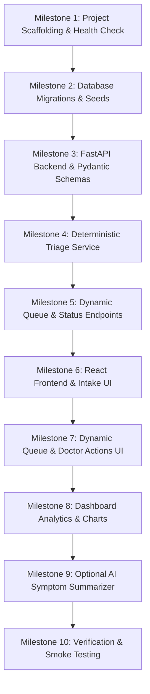

# Google Antigravity Implementation & Builder Guide — SehatSetu

> **Document Version:** 1.0.0  
> **Audience:** AI Coding Assistants & Autonomous Agents in Google Antigravity

This guide provides step-by-step instructions for AI coding agents to incrementally build, test, and verify the **SehatSetu** platform without introducing breaking changes, regressions, or architectural deviations.

---

## 1. Prime Directives for Antigravity Agents

1. **Inspect Before You Act:** Always inspect existing repository files, database schemas, and configuration before writing or replacing code.
2. **Preserve Working Code:** Refactor incrementally. Never overwrite or delete a working vertical slice to implement a new feature.
3. **Strict Separation of Concerns:**
   - Database migrations go in `supabase/migrations/`.
   - Backend logic (API routers, triage engine, schemas) goes in `backend/app/`.
   - Frontend UI (components, hooks, pages) goes in `frontend/src/`.
4. **No Simulated Database Writes:** Never create "in-memory mock lists" that discard registrations on reload unless explicitly writing unit tests. All production endpoints must interact with PostgreSQL.
5. **Enforce Clinical Safety Guardrails:** The triage engine is deterministic decision support. Never generate autonomous diagnoses or remove safety warnings.

---

## 2. Step-by-Step Implementation Sequence



---

## 3. Milestone Execution Details

### Milestone 1: Project Scaffolding
- Create directories `frontend/`, `backend/`, `supabase/migrations/`.
- Initialize `backend/requirements.txt` with `fastapi`, `uvicorn`, `pydantic`, `sqlalchemy`, `asyncpg`, `pytest`, `httpx`, `python-dotenv`.
- Initialize `frontend/` using Vite React TypeScript template with `tailwindcss`, `lucide-react`, `@tanstack/react-query`, `react-hook-form`, `zod`, `recharts`.
- **Verification:** Run `uvicorn app.main:app` and verify `GET /health` returns `200 OK`.

### Milestone 2: Database Migrations
- Write `supabase/migrations/001_initial_schema.sql` based on `docs/DATABASE_SCHEMA.md`.
- Include table definitions for `departments`, `staff_profiles`, `patients`, `visits`, `triage_assessments`, `queue_entries`, `audit_logs`.
- Create `supabase/seed.sql` with synthetic test records.
- **Verification:** Execute migrations against Supabase instance or test database.

### Milestone 3 & 4: Backend API & Triage Engine
- Implement Pydantic models in `backend/app/schemas/`.
- Implement pure deterministic scoring functions in `backend/app/services/triage_engine.py`.
- Write unit tests in `backend/tests/test_triage_engine.py` covering hypoxia, tachycardia, hypertensive crisis, and red-flag chest pain.
- **Verification:** Run `pytest tests/test_triage_engine.py` and verify 100% pass rate.

### Milestone 5: Dynamic Queue & Status Management
- Implement `GET /api/v1/queue` sorting by `(urgency_weight + wait_time_factor)`.
- Implement `POST /api/v1/queue/call-next` using row-level locking (`SELECT ... FOR UPDATE SKIP LOCKED`).
- Implement status transition endpoint `PATCH /api/v1/visits/{id}/status`.
- **Verification:** Run `pytest tests/test_queue_concurrency.py`.

### Milestone 6 & 7: React Frontend & Queue Management
- Build intake form with instant Zod validation and live triage preview.
- Build dynamic queue table with urgency badges, wait time timers, and "Call Next" button.
- Integrate TanStack Query for server state management.
- **Verification:** Register a synthetic patient in the UI and observe immediate appearance in the queue table.

### Milestone 8: Analytics Dashboard
- Build `/api/v1/analytics/overview` endpoint querying actual database timestamps.
- Render Recharts KPI summary cards, urgency distribution donut chart, and department load bar chart.
- **Verification:** Verify numbers on `/analytics` match real database records.

### Milestone 9: Optional AI Symptom Summarizer
- Implement `app/services/ai_service.py` interfacing with Google Gemini API.
- Enforce strict temperature `0.0`, extractive prompt, and try/except fallback.
- **Verification:** Test summarizer with sample chief complaints; test behavior when API key is empty.

---

## 4. Standard Agent Verification Commands

Whenever you complete a code modification, run these commands:

```powershell
# 1. Backend Linting & Test Verification
cd backend
ruff check app/
mypy app/
pytest -v

# 2. Frontend Build & Typecheck Verification
cd ../frontend
npm run typecheck
npm run lint
npm run build
```

---

## 5. Agent Reporting Template

After completing any task or milestone, structure your final report as follows:

```markdown
### Summary of Milestone Execution: [Milestone Name]
- **Files Created / Modified:**
  - `backend/app/services/triage_engine.py` (Implemented deterministic scoring)
  - `backend/tests/test_triage_engine.py` (Added 12 unit tests)
- **Commands Executed:**
  - `pytest tests/test_triage_engine.py` (12 passed in 0.4s)
  - `npm run typecheck` (0 errors)
- **Key Architectural Decisions & Safety Verification:**
  - Triage calculations are 100% deterministic and explainable.
  - No secrets or PII committed.
- **Recommended Next Step:**
  - Proceed to Milestone X (e.g. Dynamic Queue UI).
```
