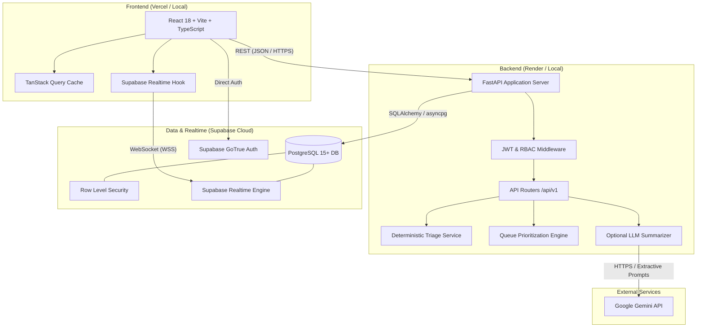
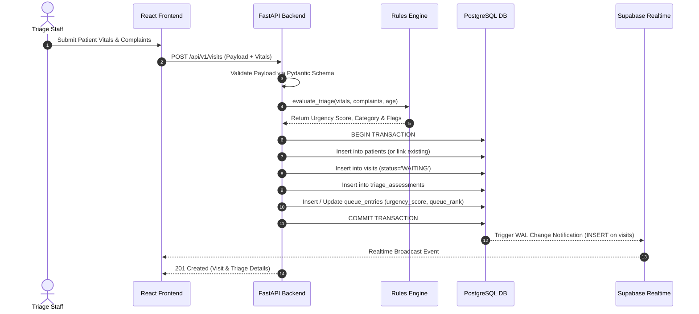
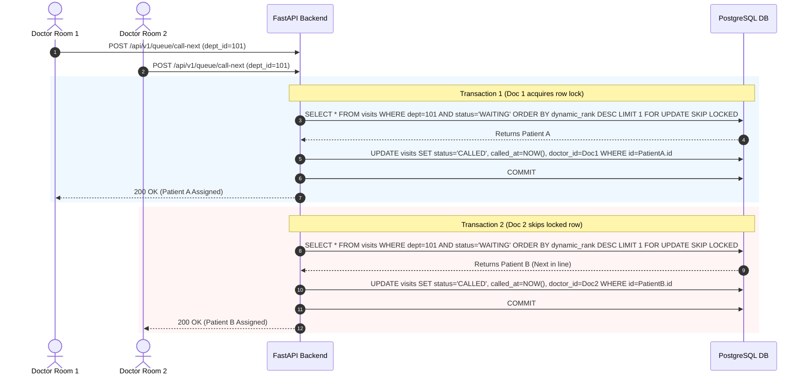

# System Architecture Document — SehatSetu

> **Document Version:** 1.0.0  
> **Status:** Approved for Implementation

---

## 1. High-Level Architecture Overview

SehatSetu is designed as a modern, decoupled web application with a **React / Vite / TypeScript Single Page Application (SPA)** on the frontend, a **Python / FastAPI REST API** backend, and a **Supabase PostgreSQL** cloud database engine providing relational storage, Row Level Security (RLS), and Realtime WebSocket subscriptions.



---

## 2. Component Responsibilities

### 2.1 Frontend Client (`frontend/`)
- **Technology:** React 18, Vite, TypeScript, Tailwind CSS, shadcn/ui, TanStack Query, React Hook Form, Zod.
- **Responsibilities:**
  - Render fast, accessible user interfaces for intake clerks, triage nurses, doctors, and hospital administrators.
  - Perform client-side data validation using Zod schemas matching backend definitions.
  - Maintain server state caching, background refetching, and optimistic queue transitions.
  - Subscribe to Supabase Realtime WebSocket events on `visits` and `queue_entries` tables to auto-refresh queues without manual polling.

### 2.2 Backend API Server (`backend/`)
- **Technology:** Python 3.11+, FastAPI, Pydantic v2, SQLAlchemy.
- **Responsibilities:**
  - Serve validated REST endpoints under `/api/v1`.
  - Execute the **Deterministic Triage Rules Engine** on patient registration or update.
  - Compute dynamic server-side queue ranking.
  - Handle atomic status transitions (`call-next`, `start-consultation`, `complete-visit`).
  - Interface with the optional AI symptom summarization service with strict timeout and fallback handling.

### 2.3 Database & Realtime Infrastructure (`supabase/`)
- **Technology:** PostgreSQL 15, Supabase Auth, Row Level Security, Realtime Publication.
- **Responsibilities:**
  - Enforce relational constraints, foreign keys, and indexes.
  - Provide table change changefeed broadcasts via PostgreSQL logical replication to connected browser clients.
  - Enforce row-level tenant/department permissions.

---

## 3. Detailed Request Lifecycle & Data Flow

### 3.1 Patient Intake & Triage Flow



---

## 4. Queue Ordering & Starvation Prevention Logic

### 4.1 Scoring Formula

To ensure patients in critical distress are seen first while simultaneously preventing low-urgency patients from starving indefinitely in the waiting room, the system computes a composite **Dynamic Priority Rank** on the server:

$$\text{Priority Rank} = (\text{Base Urgency Weight}) + (\text{Elapsed Waiting Minutes} \times \text{Aging Coefficient})$$

#### Urgency Base Weights:
- `CRITICAL`: 10,000 points (Immediate attention)
- `HIGH`: 5,000 points
- `MODERATE`: 2,000 points
- `LOW`: 500 points
- `NEEDS_REVIEW`: 1,000 points

#### Aging Coefficient:
$$\text{Aging Rate} = 10 \text{ points per minute of waiting}$$

*Example Scenario:* A `MODERATE` patient waiting for 60 minutes achieves $2000 + (60 \times 10) = 2600$ points. A newly arrived `LOW` patient starts at $500$ points. A newly arrived `HIGH` patient starts at $5000$ points and will still be prioritized above the waiting `MODERATE` patient.

### 4.2 Server-Side Queue Query

```sql
SELECT 
    v.id AS visit_id,
    p.full_name,
    p.age,
    v.status,
    ta.urgency_category,
    ta.urgency_score,
    v.created_at AS arrival_time,
    (
        CASE ta.urgency_category
            WHEN 'CRITICAL' THEN 10000
            WHEN 'HIGH' THEN 5000
            WHEN 'NEEDS_REVIEW' THEN 1000
            WHEN 'MODERATE' THEN 2000
            WHEN 'LOW' THEN 500
            ELSE 0
        END + (EXTRACT(EPOCH FROM (NOW() - v.created_at)) / 60) * 10
    ) AS dynamic_rank
FROM visits v
JOIN patients p ON v.patient_id = p.id
JOIN triage_assessments ta ON ta.visit_id = v.id
WHERE v.department_id = :dept_id 
  AND v.status = 'WAITING'
ORDER BY dynamic_rank DESC, v.created_at ASC;
```

---

## 5. Concurrency & "Call Next" Atomic Locking

To prevent race conditions where multiple doctors in the same department attempt to call the same waiting patient simultaneously:



---

## 6. Realtime Synchronization Architecture

1. **PostgreSQL Write:** When an intake clerk registers a patient or a doctor changes a visit status, an SQL `INSERT` or `UPDATE` is committed.
2. **Supabase Realtime Publication:** Supabase listens to Postgres write-ahead logs (WAL) on the `visits` and `queue_entries` tables.
3. **WebSocket Broadcast:** Updates are broadcast to subscribed channels: `room:department:{department_id}`.
4. **TanStack Query Invalidation:** The React client receives the payload and invalidates the `['queue', departmentId]` and `['analytics']` query keys, prompting an instantaneous UI refresh.

---

## 7. External Integrations & Graceful Failure Degradation

| Subsystem | Potential Failure Mode | Graceful Fallback Strategy |
| :--- | :--- | :--- |
| **Google Gemini API** | Rate limited (429), API downtime (503), invalid key | Catch exception in `AIService`, log warning, return raw unsummarized chief complaints to UI with `is_ai_generated=false`. Triage rule engine is unaffected. |
| **Supabase Realtime** | WebSocket disconnect or firewall block | TanStack Query falls back to background polling (e.g., every 15 seconds) to maintain queue accuracy. |
| **Database Pool** | Connection exhaustion during surge | FastAPI returns standard 503 Service Unavailable with Retry-After header; retry policy with exponential backoff on client. |
