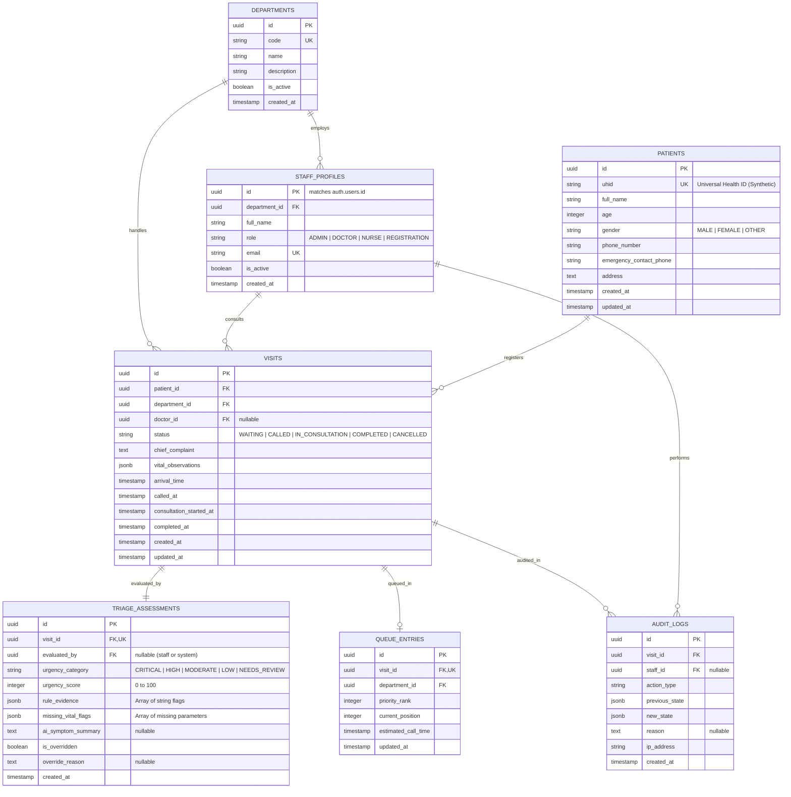

# Database Schema Specification — SehatSetu

> **Document Version:** 1.0.0  
> **Target Database Engine:** PostgreSQL 15+ (Supabase Managed PostgreSQL)

---

## 1. Entity-Relationship (ER) Diagram



---

## 2. Enumerated Types (Enums)

```sql
-- Urgency Category Classification
CREATE TYPE urgency_category_enum AS ENUM (
    'CRITICAL',
    'HIGH',
    'MODERATE',
    'LOW',
    'NEEDS_REVIEW'
);

-- Visit Lifecycle Status
CREATE TYPE visit_status_enum AS ENUM (
    'WAITING',
    'CALLED',
    'IN_CONSULTATION',
    'COMPLETED',
    'CANCELLED'
);

-- Staff Role Types
CREATE TYPE user_role_enum AS ENUM (
    'ADMIN',
    'DOCTOR',
    'NURSE',
    'REGISTRATION'
);

-- Gender Types
CREATE TYPE gender_enum AS ENUM (
    'MALE',
    'FEMALE',
    'OTHER'
);
```

---

## 3. Detailed Table Specifications

### 3.1 `departments`
Stores hospital clinical departments (e.g., Emergency, General Medicine, Pediatrics, Orthopedics).

```sql
CREATE TABLE departments (
    id UUID PRIMARY KEY DEFAULT gen_random_uuid(),
    code VARCHAR(20) NOT NULL UNIQUE,
    name VARCHAR(100) NOT NULL,
    description TEXT,
    is_active BOOLEAN NOT NULL DEFAULT true,
    created_at TIMESTAMPTZ NOT NULL DEFAULT NOW()
);
```

### 3.2 `staff_profiles`
Links Supabase authenticated users (`auth.users`) with hospital clinical roles and assigned departments.

```sql
CREATE TABLE staff_profiles (
    id UUID PRIMARY KEY REFERENCES auth.users(id) ON DELETE CASCADE,
    department_id UUID REFERENCES departments(id) ON DELETE SET NULL,
    full_name VARCHAR(150) NOT NULL,
    role user_role_enum NOT NULL DEFAULT 'NURSE',
    email VARCHAR(255) NOT NULL UNIQUE,
    is_active BOOLEAN NOT NULL DEFAULT true,
    created_at TIMESTAMPTZ NOT NULL DEFAULT NOW(),
    updated_at TIMESTAMPTZ NOT NULL DEFAULT NOW()
);
```

### 3.3 `patients`
Demographic records for registered hospital patients.

```sql
CREATE TABLE patients (
    id UUID PRIMARY KEY DEFAULT gen_random_uuid(),
    uhid VARCHAR(50) NOT NULL UNIQUE, -- e.g., 'SS-2026-0001'
    full_name VARCHAR(150) NOT NULL,
    age INTEGER NOT NULL CHECK (age >= 0 AND age <= 130),
    gender gender_enum NOT NULL,
    phone_number VARCHAR(20),
    emergency_contact_phone VARCHAR(20),
    address TEXT,
    created_at TIMESTAMPTZ NOT NULL DEFAULT NOW(),
    updated_at TIMESTAMPTZ NOT NULL DEFAULT NOW()
);
```

### 3.4 `visits`
Represents a specific patient arrival and consultation lifecycle.

```sql
CREATE TABLE visits (
    id UUID PRIMARY KEY DEFAULT gen_random_uuid(),
    patient_id UUID NOT NULL REFERENCES patients(id) ON DELETE CASCADE,
    department_id UUID NOT NULL REFERENCES departments(id) ON DELETE RESTRICT,
    doctor_id UUID REFERENCES staff_profiles(id) ON DELETE SET NULL,
    status visit_status_enum NOT NULL DEFAULT 'WAITING',
    chief_complaint TEXT NOT NULL,
    vital_observations JSONB NOT NULL DEFAULT '{}'::jsonb,
    arrival_time TIMESTAMPTZ NOT NULL DEFAULT NOW(),
    called_at TIMESTAMPTZ,
    consultation_started_at TIMESTAMPTZ,
    completed_at TIMESTAMPTZ,
    created_at TIMESTAMPTZ NOT NULL DEFAULT NOW(),
    updated_at TIMESTAMPTZ NOT NULL DEFAULT NOW()
);

-- Indexes for fast queue sorting & filtering
CREATE INDEX idx_visits_dept_status ON visits(department_id, status);
CREATE INDEX idx_visits_patient_id ON visits(patient_id);
CREATE INDEX idx_visits_arrival_time ON visits(arrival_time);
```

**`vital_observations` JSONB Structure Example:**
```json
{
  "systolic_bp": 140,
  "diastolic_bp": 90,
  "heart_rate": 105,
  "respiratory_rate": 22,
  "spo2": 93,
  "temperature_f": 101.4,
  "blood_glucose_mg_dl": 145,
  "gcs": 15
}
```

### 3.5 `triage_assessments`
Stores the result of the preliminary triage rules engine evaluation and clinical overrides.

```sql
CREATE TABLE triage_assessments (
    id UUID PRIMARY KEY DEFAULT gen_random_uuid(),
    visit_id UUID NOT NULL UNIQUE REFERENCES visits(id) ON DELETE CASCADE,
    evaluated_by UUID REFERENCES staff_profiles(id) ON DELETE SET NULL,
    urgency_category urgency_category_enum NOT NULL DEFAULT 'NEEDS_REVIEW',
    urgency_score INTEGER NOT NULL CHECK (urgency_score >= 0 AND urgency_score <= 100),
    rule_evidence JSONB NOT NULL DEFAULT '[]'::jsonb,
    missing_vital_flags JSONB NOT NULL DEFAULT '[]'::jsonb,
    ai_symptom_summary TEXT,
    is_overridden BOOLEAN NOT NULL DEFAULT false,
    override_reason TEXT,
    created_at TIMESTAMPTZ NOT NULL DEFAULT NOW(),
    updated_at TIMESTAMPTZ NOT NULL DEFAULT NOW()
);

CREATE INDEX idx_triage_urgency ON triage_assessments(urgency_category, urgency_score DESC);
```

### 3.6 `queue_entries`
Materialized queue ranking and estimated wait position cache (can be dynamically queried or materialized).

```sql
CREATE TABLE queue_entries (
    id UUID PRIMARY KEY DEFAULT gen_random_uuid(),
    visit_id UUID NOT NULL UNIQUE REFERENCES visits(id) ON DELETE CASCADE,
    department_id UUID NOT NULL REFERENCES departments(id) ON DELETE CASCADE,
    priority_rank INTEGER NOT NULL DEFAULT 0,
    current_position INTEGER,
    estimated_call_time TIMESTAMPTZ,
    updated_at TIMESTAMPTZ NOT NULL DEFAULT NOW()
);

CREATE INDEX idx_queue_dept_rank ON queue_entries(department_id, priority_rank DESC);
```

### 3.7 `audit_logs`
Immutable record of all critical state transitions, queue priority overrides, and clinical actions.

```sql
CREATE TABLE audit_logs (
    id UUID PRIMARY KEY DEFAULT gen_random_uuid(),
    visit_id UUID REFERENCES visits(id) ON DELETE SET NULL,
    staff_id UUID REFERENCES staff_profiles(id) ON DELETE SET NULL,
    action_type VARCHAR(50) NOT NULL, -- e.g., 'STATUS_UPDATE', 'PRIORITY_OVERRIDE', 'INTAKE'
    previous_state JSONB,
    new_state JSONB,
    reason TEXT,
    ip_address VARCHAR(45),
    created_at TIMESTAMPTZ NOT NULL DEFAULT NOW()
);

CREATE INDEX idx_audit_visit_id ON audit_logs(visit_id);
CREATE INDEX idx_audit_created_at ON audit_logs(created_at DESC);
```

---

## 4. MVP vs. Post-Hackathon Simplification Matrix

| Table | MVP Implementation (2-Hour Sprint) | Production Expansion |
| :--- | :--- | :--- |
| `departments` | Seeded with 3 static departments (`EMERGENCY`, `GEN_MED`, `PEDIATRICS`). | Full CRUD management UI with dynamic staffing quotas. |
| `staff_profiles` | Pre-seeded mock accounts or Supabase magic link login. | Full enterprise RBAC with SSO/OAuth2 and shifts. |
| `patients` | Direct insert on intake; simple synthetic UHID generation. | Deduplication algorithm matching Aadhaar/ABHA ID. |
| `visits` | Core table tracking intake, vitals JSONB, and status. | Multi-stage clinical notes, prescriptions, and lab orders. |
| `triage_assessments` | Immediate evaluation on visit creation via FastAPI backend. | Versioned clinical rule matrix with audit diffs. |
| `queue_entries` | Computed dynamically via server SQL query (`VIEW` or `ORDER BY`). | Materialized real-time queue table with ML wait prediction. |
| `audit_logs` | Written automatically on status transition & override endpoints. | Tamper-evident append-only ledger with SIEM export. |

---

## 5. Row Level Security (RLS) Policies

```sql
-- Enable RLS across clinical tables
ALTER TABLE patients ENABLE ROW LEVEL SECURITY;
ALTER TABLE visits ENABLE ROW LEVEL SECURITY;
ALTER TABLE triage_assessments ENABLE ROW LEVEL SECURITY;
ALTER TABLE queue_entries ENABLE ROW LEVEL SECURITY;
ALTER TABLE audit_logs ENABLE ROW LEVEL SECURITY;

-- Allow authenticated hospital staff to view all active patients and visits
CREATE POLICY "Allow authenticated staff to read patients"
ON patients FOR SELECT
TO authenticated
USING (true);

CREATE POLICY "Allow authenticated staff to insert patients"
ON patients FOR INSERT
TO authenticated
WITH CHECK (true);

CREATE POLICY "Allow authenticated staff to read visits"
ON visits FOR SELECT
TO authenticated
USING (true);

CREATE POLICY "Allow authenticated staff to update visits"
ON visits FOR UPDATE
TO authenticated
USING (true)
WITH CHECK (true);
```
