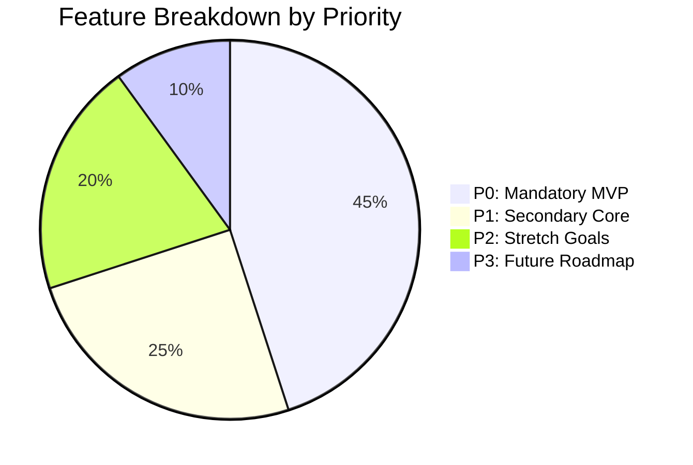

# Feature Backlog & Prioritization Matrix — SehatSetu

> **Document Version:** 1.0.0  
> **Prioritization Scheme:** P0 (Mandatory MVP), P1 (High Priority), P2 (Stretch / Post-Demo), P3 (Future Roadmap)

---

## 1. Feature Priority Overview

---

## 2. Prioritized Feature Catalog

### 2.1 P0: Mandatory MVP (Hackathon 2-Hour Deliverable)

| Feature ID | Feature Name | Description | Dependencies | Acceptance Criteria |
| :--- | :--- | :--- | :--- | :--- |
| **FEAT-01** | **Patient Intake & Vitals Form** | Single-screen demographic and vital signs capture with instant range validation. | DB Schema | Records save to `patients` and `visits` tables; invalid vitals (e.g. SpO2 > 100) are blocked. |
| **FEAT-02** | **Deterministic Triage Rules Engine** | Evaluates physiological vitals + red-flag symptom patterns and outputs urgency category & score. | FEAT-01 | Computes `CRITICAL`, `HIGH`, `MODERATE`, `LOW`, or `NEEDS_REVIEW` with human-readable evidence strings. |
| **FEAT-03** | **Dynamic Urgency Queue** | Server-side prioritized queue sorting patients by urgency score and arrival timestamp. | FEAT-02 | Higher urgency patients automatically position above lower urgency cases; elapsed wait time increments priority. |
| **FEAT-04** | **Call Next & Consultation Lifecycle** | Atomic action to call the next patient, advance status to `IN_CONSULTATION`, and mark `COMPLETED`. | FEAT-03 | Status updates reflect across UI; no race condition when multiple doctors click call-next. |
| **FEAT-05** | **Staff Overview Analytics** | Live dashboard showing total patients registered, waiting, in consultation, and average wait time. | FEAT-04 | Metrics calculated from actual stored database timestamps. |

---

### 2.2 P1: Secondary Core Enhancements

| Feature ID | Feature Name | Description | Dependencies | Acceptance Criteria |
| :--- | :--- | :--- | :--- | :--- |
| **FEAT-06** | **Realtime WebSocket Sync** | Instant UI updates via Supabase Realtime channel on `visits` table modifications. | FEAT-03 | Doctor screen updates within 1 second of nurse saving registration in separate tab. |
| **FEAT-07** | **Priority Override with Audit** | Doctor/Nurse can escalate or de-escalate patient urgency with a mandatory text reason. | FEAT-03 | Override updates `triage_assessments.is_overridden` and writes to `audit_logs`. |
| **FEAT-08** | **Department Workload Filter** | Filter queues and analytics by Emergency, General Medicine, Pediatrics, Orthopedics. | FEAT-01 | UI tabs filter active visits strictly by selected `department_id`. |
| **FEAT-09** | **Missing Vital Warning Flags** | Detects omitted vitals for critical symptoms and flags visit as `NEEDS_REVIEW`. | FEAT-02 | Missing parameters listed in UI with prompt to re-evaluate. |

---

### 2.3 P2: Stretch Features & AI Enhancements

| Feature ID | Feature Name | Description | Dependencies | Acceptance Criteria |
| :--- | :--- | :--- | :--- | :--- |
| **FEAT-10** | **Extractive Symptom Summarization** | Google Gemini API module synthesizing raw chief complaints into 2-3 structured clinical bullet points. | FEAT-01, Gemini API | Summary is strictly extractive with zero diagnostic claims; falls back gracefully to raw text if offline. |
| **FEAT-11** | **Multilingual Intake Support** | UI localization and symptom intake in Hindi and regional languages with English clinical translation. | FEAT-01 | Intake staff can enter symptoms in Hindi; doctor sees translated English summary. |
| **FEAT-12** | **Estimated Wait Time Projection** | Dynamic waiting time estimation based on current doctor consultation pace and queue depth. | FEAT-05 | Shows estimated call time with disclosed assumptions. |

---

### 2.4 P3: Future Production Roadmap

| Feature ID | Feature Name | Description | Target Milestone |
| :--- | :--- | :--- | :--- |
| **FEAT-13** | **ABHA / Ayushman Bharat Integration** | Direct scan and integration with India's National Digital Health Mission (ABHA ID). | Production V2 |
| **FEAT-14** | **Bedside Monitor Hardware Bridge** | Automatic ingestion of vitals from bedside multipara monitors via HL7 / MQTT. | Production V2 |
| **FEAT-15** | **SMS / WhatsApp Token Alerts** | Automated SMS notification to waiting patients when their queue position is within top 3. | Production V2 |
