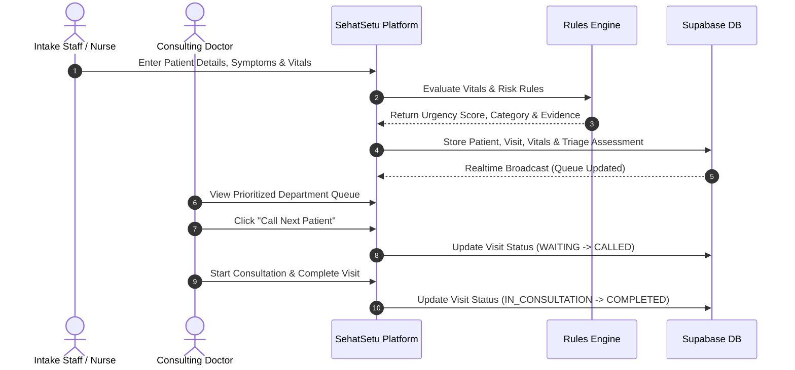

# Product Requirements Document (PRD) — SehatSetu

> **Document Version:** 1.0.0  
> **Status:** Approved for Implementation  
> **Target Release:** Hackathon Prototype & V1 Release

---

## 1. Executive Summary & Problem Context

In developing nations and high-density urban public hospitals, outpatient departments (OPDs) and emergency rooms (ERs) face extreme patient loads. In typical scenarios:
- **First-Come, First-Served Bottlenecks:** Patients are queued strictly by arrival order, meaning a critically deteriorating patient (e.g., severe hypoxemia or acute chest pain) may sit behind dozens of mild elective cases.
- **Triage Burnout & Human Error:** Overworked triage nurses must manually evaluate hundreds of patients rapidly without standardized, explainable scoring tools.
- **Lack of Transparency:** Patients and staff have zero visibility into estimated waiting times or department bottlenecks, causing waiting hall congestion and friction.
- **Fragmented Data Flow:** Patient vital signs recorded at entry are often written on physical slips that fail to reach the consulting doctor in real time.

**SehatSetu** solves these issues by providing a synchronized web platform that enables rapid registration, standardized deterministic preliminary triage categorization, dynamic server-side queue prioritization, and department-level operational dashboards.

---

## 2. Target User Personas

| Persona | Role & Context | Primary Needs & Pain Points |
| :--- | :--- | :--- |
| **Nurse Sunita (Triage Nurse)** | ER / OPD intake nurse handling 40+ registrations per hour. | Needs rapid data entry (keyboard friendly), automatic vital range validation, clear warning flags, and explainable preliminary urgency suggestions. |
| **Dr. Rajesh (Consulting Physician)** | Attending doctor in Internal Medicine / Emergency. | Needs an orderly, auto-prioritized queue, 1-click patient calling, instant visibility into triage evidence and symptoms, and ability to mark visits completed. |
| **Ramesh (Intake Desk Clerk)** | Front-desk hospital staff registering arriving patients. | Fast demographic search/creation, immediate ticket issuance, and clear queue assignment. |
| **Dr. Priya (Medical Superintendent / Admin)** | Hospital operations lead monitoring facility performance. | Real-time departmental metrics, average wait-time analytics, queue bottleneck alerts, and historical audit logs. |

---

## 3. Goals and Non-Goals

### Project Goals
- **G-1 (Rapid Intake):** Enable registration of a new or returning patient with baseline vital observations in under 60 seconds.
- **G-2 (Deterministic Urgency Scoring):** Provide transparent, rule-based urgency classification (`CRITICAL`, `HIGH`, `MODERATE`, `LOW`, `NEEDS_REVIEW`) with clear evidence reasons and missing vital flags.
- **G-3 (Dynamic Queue Prioritization):** Maintain a live, server-sorted queue where urgent cases automatically rise above non-urgent cases while preventing long-term starvation of lower-urgency patients.
- **G-4 (Clinical Autonomy & Auditability):** Enable clinical staff to override automated priority levels with mandatory rationale, recording an immutable audit trail.
- **G-5 (Realtime Synchronization):** Ensure updates across registration, triage, and doctor desks propagate in real-time (< 1s latency).
- **G-6 (Extractive AI Summary):** Provide an optional, strictly extractive symptom summarization module to streamline doctor review.

### Non-Goals (Out of Scope for Prototype)
- **NG-1:** Autonomous medical diagnosis or automated prescription generation.
- **NG-2:** Full bi-directional EHR integration (FHIR/HL7) or billing/insurance claims processing.
- **NG-3:** Direct integration with proprietary bedside hardware monitors.
- **NG-4:** Replacement of formal hospital triage protocols (e.g., ESI, MTS, CTAS); SehatSetu provides preliminary decision support for queue ordering.

---

## 4. End-to-End Workflow & User Stories

### User Stories

- **US-1 (Registration & Intake):** *As an intake nurse*, I want to record patient demographics, chief complaints, and vitals (BP, HR, RR, SpO2, Temp, GCS) on one screen so that the patient is immediately registered into the hospital system.
- **US-2 (Triage Explanation):** *As a triage nurse*, I want to see the exact reasons why a patient was categorized as `CRITICAL` or `HIGH` (e.g., "SpO2 < 90% (88%)") so that I can verify the assessment before confirming entry.
- **US-3 (Dynamic Queue):** *As a consulting doctor*, I want to see a live list of waiting patients ordered by clinical urgency and arrival time so that the sickest patients receive attention first.
- **US-4 (Patient Calling & Consultation):** *As a doctor*, I want to click "Call Next", view the patient's vitals, examine their symptom summary, and transition them to "Completed" with one click.
- **US-5 (Priority Override):** *As an attending clinician*, I want to manually escalate or de-escalate a patient's queue priority with a recorded note if clinical presentation differs from recorded vitals.
- **US-6 (Operational Analytics):** *As a hospital administrator*, I want to see live graphs of waiting times, active patient count by department, and triage category distribution to allocate staff effectively.

---

## 5. Functional Requirements

### 5.1 Patient Registration & Intake
- **FR-1.1:** System shall record mandatory demographic fields: Full Name, Age (or DOB), Gender, Phone Number, and Chief Complaint.
- **FR-1.2:** System shall capture optional vital sign observations with explicit units:
  - Systolic / Diastolic Blood Pressure ($mmHg$)
  - Heart Rate ($bpm$)
  - Respiratory Rate ($breaths/min$)
  - Oxygen Saturation ($\% \text{ SpO}_2$)
  - Body Temperature ($^\circ\text{F}$ or $^\circ\text{C}$)
  - Blood Glucose Level ($mg/dL$)
  - Glasgow Coma Scale ($3 - 15$)
- **FR-1.3:** System shall validate input ranges in real time (e.g., SpO2 between 0–100%, Heart Rate between 20–300 bpm).

### 5.2 Deterministic Triage Rules Engine
- **FR-2.1:** System shall evaluate vital signs against predefined physiological thresholds and symptom keyword triggers.
- **FR-2.2:** System shall assign one of five urgency categories:
  - `CRITICAL` (Immediate emergency; severe hypoxia, altered mental state, severe shock)
  - `HIGH` (Urgent; marked tachycardia, high fever with altered vitals, chest pain)
  - `MODERATE` (Standard acute; moderate pain, stable vitals, persistent symptoms)
  - `LOW` (Non-urgent; minor injuries, chronic routine visits, mild cold)
  - `NEEDS_REVIEW` (Missing critical vitals or ambiguous symptom profile)
- **FR-2.3:** System shall return an array of human-readable `evidence` strings detailing which rule conditions were triggered.
- **FR-2.4:** System shall identify `missing_vital_flags` when key indicators are omitted.

### 5.3 Queue Management & Status Lifecycle
- **FR-3.1:** System shall maintain visit statuses: `WAITING`, `CALLED`, `IN_CONSULTATION`, `COMPLETED`, `CANCELLED`.
- **FR-3.2:** Active queue sorting must be computed server-side using the formula:
  $$\text{Sort Rank} = (\text{Urgency Weight}) \times W_u - (\text{Elapsed Wait Time Seconds}) \times W_t$$
  ensuring higher urgency cases take precedence while wait time accumulates priority.
- **FR-3.3:** System shall provide atomic "Call Next" functionality that transitions the top `WAITING` patient to `CALLED`.
- **FR-3.4:** System shall support manual priority overrides with a mandatory text reason, logged in the audit trail.

### 5.4 Operational Analytics & Dashboard
- **FR-4.1:** Real-time counters for Total Active Patients, Waiting Patients, In Consultation, and Completed Today.
- **FR-4.2:** Departmental breakdown chart showing patient distribution across General Medicine, Emergency, Pediatrics, Orthopedics, etc.
- **FR-4.3:** Average waiting time calculation based on actual timestamps (`created_at` to `called_at`).

### 5.5 Optional AI Symptom Summarization
- **FR-5.1:** If enabled, the system may generate a structured 2–3 line summary highlighting chief complaint, duration, and aggravating factors.
- **FR-5.2:** AI output must be extractive and read-only; it cannot mutate triage scores or invent unstated clinical details.
- **FR-5.3:** If the AI service fails or times out, the raw symptom text must display gracefully without error.

---

## 6. Non-Functional Requirements

- **NFR-1 (Performance):** Triage rule evaluation must execute in $< 50\text{ ms}$. Queue retrieval queries must respond in $< 200\text{ ms}$ under a load of 1,000 active visits.
- **NFR-2 (Availability & Reliability):** Graceful degradation if external AI APIs fail; core triage and queue ordering must continue functioning 100% deterministically.
- **NFR-3 (Usability & Accessibility):** Responsive design supporting desktop monitors (nurse stations/doctor desks) and tablets (triage mobile stations). High-contrast UI adhering to WCAG 2.1 AA.
- **NFR-4 (Security & Privacy):** JWT-based authentication for staff. Row Level Security on database tables. No sensitive PHI exposed in unauthenticated endpoints.
- **NFR-5 (Data Integrity):** Relational integrity with foreign key constraints and transactional status transitions.

---

## 7. MVP Acceptance Criteria

To complete the hackathon MVP, the system must demonstrate:
1. Registration of a synthetic patient with vitals.
2. Immediate calculation and display of preliminary triage category (`CRITICAL`, `HIGH`, etc.) with rule breakdown.
3. Patient automatically added to the department queue in correct urgency-sorted order.
4. Doctor dashboard displaying the updated queue via real-time sync.
5. Doctor clicking "Call Patient" and "Complete Visit" with accurate status changes.
6. Admin analytics showing updated patient counts and calculated wait times.
