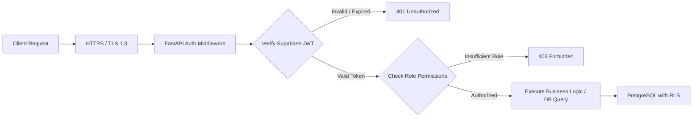

# Security, Privacy & Compliance Architecture — SehatSetu

> **Document Version:** 1.0.0  
> **Classification:** Security Architecture & Health Data Governance

---

## 1. Authentication & Authorization Framework

SehatSetu implements a multi-layered security architecture ensuring that only authenticated, verified hospital personnel can access clinical records and transition queue states.



### 1.1 Role-Based Access Control (RBAC) Matrix

| User Role | Patient Registration | View Queue | Call Patient & Consult | Override Priority | View Analytics | Manage Depts / Staff |
| :--- | :---: | :---: | :---: | :---: | :---: | :---: |
| **`REGISTRATION`** | ✅ | ✅ (Read-only) | ❌ | ❌ | ❌ | ❌ |
| **`NURSE`** | ✅ | ✅ | ❌ | ✅ (With audit note)| ❌ | ❌ |
| **`DOCTOR`** | ✅ | ✅ | ✅ | ✅ (With audit note)| ✅ | ❌ |
| **`ADMIN`** | ✅ | ✅ | ✅ | ✅ | ✅ | ✅ |

---

## 2. Row Level Security (RLS) & The Service Role Hazard

### 2.1 The Supabase Service Role Hazard

> [!CAUTION]
> **CRITICAL SECURITY WARNING: Supabase Service Role Key**  
> The `SUPABASE_SERVICE_ROLE_KEY` has **admin-level privileges that completely bypass PostgreSQL Row Level Security (RLS)**.  
> 
> 1. **NEVER** expose the Service Role key in frontend code, client builds (`VITE_*` env vars), git repositories, or client-side HTTP requests.
> 2. The frontend client must **ONLY** possess the `VITE_SUPABASE_ANON_KEY`.
> 3. The backend server should only utilize the Service Role key for verified administrative tasks, while using authenticated user context or scoped service credentials for clinical read/write operations.

### 2.2 PostgreSQL RLS Policies Example

```sql
-- Enforce RLS on visits table
ALTER TABLE visits ENABLE ROW LEVEL SECURITY;

-- Staff can only view visits from their assigned department or all if Admin/Triage
CREATE POLICY "Department scoped visit access"
ON visits FOR SELECT
TO authenticated
USING (
    EXISTS (
        SELECT 1 FROM staff_profiles sp
        WHERE sp.id = auth.uid()
          AND (sp.role IN ('ADMIN', 'REGISTRATION') OR sp.department_id = visits.department_id)
    )
);

-- Only Doctors and Admins can update consultation status
CREATE POLICY "Doctor update consultation status"
ON visits FOR UPDATE
TO authenticated
USING (
    EXISTS (
        SELECT 1 FROM staff_profiles sp
        WHERE sp.id = auth.uid()
          AND sp.role IN ('DOCTOR', 'ADMIN')
    )
);
```

---

## 3. Data Protection & Privacy Governance

### 3.1 Strict Synthetic Data Mandate
- In accordance with healthcare privacy standards (such as HIPAA in the US and DISHA / Digital Personal Data Protection Act in India), **no real patient information, names, phone numbers, or actual clinical histories may be introduced into this development repository or test fixtures**.
- All demonstrations, automated test suites, and database seed scripts must strictly utilize generated synthetic fixtures (e.g. `Aarav Sharma`, `UHID: SS-2026-0001`).

### 3.2 Data Minimization & Input Sanitization
- **Validation:** All inputs are strictly typed and validated twice:
  - Client-side via **Zod** schema validation.
  - Server-side via **Pydantic v2** models before reaching any database query.
- **SQL Injection Defense:** All database queries utilize parameterized queries via SQLAlchemy ORM or Supabase client query builders.
- **XSS & Content Security:** All patient notes and chief complaints are sanitized and escaped prior to rendering in React DOM.

---

## 4. Audit Trail & Non-Repudiation

To guarantee accountability in emergency triage and prevent unauthorized manipulation of patient queues:
1. Every change in visit status (`WAITING` $\rightarrow$ `CALLED` $\rightarrow$ `IN_CONSULTATION` $\rightarrow$ `COMPLETED`) writes an entry to `audit_logs`.
2. Every manual urgency override requires a text explanation and captures the authenticated `staff_id`, `previous_category`, `new_category`, and client `ip_address`.
3. The `audit_logs` table is append-only; `UPDATE` and `DELETE` actions are revoked at the PostgreSQL permission level for regular application users.

```sql
-- Revoke destructive permissions on audit logs
REVOKE UPDATE, DELETE, TRUNCATE ON audit_logs FROM authenticated;
REVOKE UPDATE, DELETE, TRUNCATE ON audit_logs FROM anon;
```

---

## 5. Network & Transport Security

- **HTTPS / TLS 1.3:** Mandatory in production (enforced automatically by Vercel and Render).
- **CORS Configuration:** Explicitly whitelist frontend origin domains (e.g. `http://localhost:5173` in development, `https://sehatsetu.vercel.app` in production). Wildcard `*` CORS origins are prohibited in production.
- **Rate Limiting:** Protect registration and login endpoints against brute-force or denial-of-service surges using FastAPI slowapi/limiter middleware (e.g., maximum 60 requests/minute per IP on intake endpoints).
