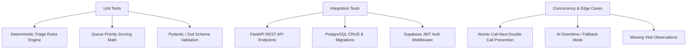

# Testing Strategy & Test Suites — SehatSetu

> **Document Version:** 1.0.0  
> **Target Frameworks:** `pytest` (Backend), `@testing-library/react` + `vitest` (Frontend)

---

## 1. Testing Strategy Overview



---

## 2. Backend Unit Test Suite: Triage Rules Engine

`backend/tests/test_triage_engine.py` tests all physiological boundary conditions:

```python
import pytest
from app.services.triage_engine import evaluate_triage
from app.schemas.triage import VitalObservations

def test_critical_hypoxia():
    vitals = VitalObservations(spo2=88, heart_rate=95, systolic_bp=120)
    result = evaluate_triage(vitals=vitals, chief_complaint="Difficulty breathing", age=45)
    assert result.urgency_category == "CRITICAL"
    assert any("Oxygen Saturation" in ev for ev in result.rule_evidence)

def test_hypertensive_crisis_and_tachycardia():
    vitals = VitalObservations(spo2=96, heart_rate=125, systolic_bp=185)
    result = evaluate_triage(vitals=vitals, chief_complaint="Headache", age=52)
    assert result.urgency_category in ["CRITICAL", "HIGH"]
    assert result.urgency_score >= 70

def test_red_flag_chest_pain_keyword():
    vitals = VitalObservations(spo2=98, heart_rate=80, systolic_bp=125)
    complaint = "Crushing chest pain radiating to left arm with cold sweats"
    result = evaluate_triage(vitals=vitals, chief_complaint=complaint, age=50)
    assert result.urgency_category == "CRITICAL"
    assert any("Chest pain" in ev for ev in result.rule_evidence)

def test_missing_vitals_detection():
    vitals = VitalObservations(heart_rate=78) # SpO2, BP omitted
    result = evaluate_triage(vitals=vitals, chief_complaint="Mild ankle sprain", age=25)
    assert "spo2" in result.missing_vital_flags
    assert "systolic_bp" in result.missing_vital_flags
    assert result.urgency_category == "LOW"
```

---

## 3. Dynamic Queue & Concurrency Tests

`backend/tests/test_queue_concurrency.py` verifies server-side ordering and atomic `call-next` locking:

```python
import pytest
import asyncio
from httpx import AsyncClient
from app.main import app

@pytest.mark.asyncio
async def test_queue_ordering_urgency_precedence():
    async with AsyncClient(app=app, base_url="http://test") as ac:
        # Fetch queue for Emergency department
        response = await ac.get("/api/v1/queue?department_id=dept-emergency")
        assert response.status_code == 200
        queue = response.json()["data"]
        
        # Verify Critical patients are ranked above Moderate/Low patients
        for i in range(len(queue) - 1):
            assert queue[i]["calculated_priority_rank"] >= queue[i+1]["calculated_priority_rank"]

@pytest.mark.asyncio
async def test_concurrent_call_next_race_condition():
    """Verify that two doctors calling next at the exact same moment receive different patients."""
    async with AsyncClient(app=app, base_url="http://test") as ac:
        task1 = ac.post("/api/v1/queue/call-next", json={"department_id": "dept-emergency", "room": "Room 1"})
        task2 = ac.post("/api/v1/queue/call-next", json={"department_id": "dept-emergency", "room": "Room 2"})
        
        resp1, resp2 = await asyncio.gather(task1, task2)
        assert resp1.status_code == 200
        assert resp2.status_code == 200
        
        # Ensure distinct patient visits were assigned
        visit1 = resp1.json()["data"]["visit_id"]
        visit2 = resp2.json()["data"]["visit_id"]
        assert visit1 != visit2, "Race condition: Both doctors were assigned the exact same patient visit!"
```

---

## 4. AI Failure & Graceful Fallback Tests

`backend/tests/test_ai_fallback.py` validates system behavior when the external LLM is offline:

```python
import pytest
from app.services.ai_service import summarize_symptoms

@pytest.mark.asyncio
async def test_ai_fallback_on_invalid_key_or_timeout(monkeypatch):
    # Simulate API error or missing key
    monkeypatch.setenv("GEMINI_API_KEY", "")
    
    raw_complaint = "Patient has severe dry cough for 3 days and high fever."
    result = await summarize_symptoms(raw_complaint)
    
    # Must return original text safely without crashing
    assert result.is_ai_generated is False
    assert raw_complaint in result.summary
```

---

## 5. Automated Test Execution Commands

```powershell
# Run complete backend test suite with coverage
cd backend
pytest -v --cov=app tests/

# Run specific triage rule tests
pytest tests/test_triage_engine.py -k "test_critical"

# Frontend unit and component tests
cd ../frontend
npm run test
```
